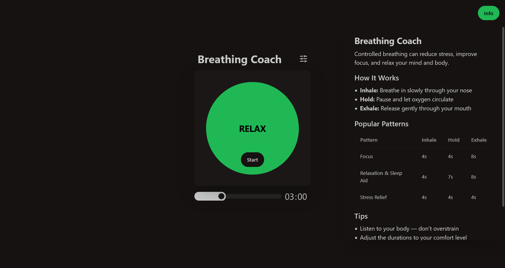

# Breathing Coach App

Prosta aplikacja webowa do kontrolowanego oddychania, która pomaga się zrelaksować, poprawić koncentrację i ogólnie zadbać o zdrowie psychiczne. Umożliwia ustawienie czasu trwania faz wdechu, wydechu i wstrzymania oddechu oraz korzystanie z popularnych wzorców oddechowych, takich jak 4-2-4 czy 4-7-8.

---

## Screenshot

---

## Filmik pokazowy

---

## Funkcjonalności

- Regulacja czasu trwania poszczególnych faz oddechu
- Popularne wzorce oddechowe wbudowane w aplikację
- Widok desktopowy z wysuwanym panelem informacyjnym
- Widok mobilny
- Animacja faz oddechowych dla łatwego śledzenia

---

## Technologie / Pakiety

- Angular
- TailwindCSS i DaisyUI
- HTML5, TypeScript, CSS
- RxJS do ewentualnego zarządzania przepływem zdarzeń (w bardziej zaawansowanych komponentach)
- NgRx do zarządzania ustawieniami
- gsap do zarządzania animacjami

---

